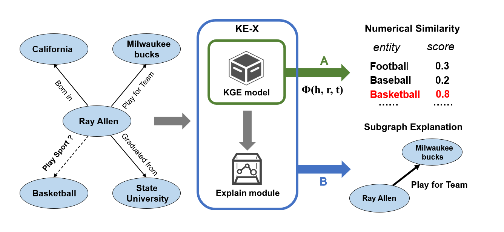

<h1 align="center">
  KE-X
</h1>


### Overview
<h2 align="center">
  
</h2>

### Dependencies

- Compatible with PyTorch 1.8 and Python 3.7.x.
- Dependencies can be installed using `requirements.txt`.

### Prepare:


-  Obtain pretraining entity and relation embeddings for fb15k-237,NELL-995, and YAGO3-10 dataset, we recommend using  [OpenKE](https://github.com/thunlp/OpenKE).
-  Save the pretrained embeddings as  **.npy** format with numpy, and then rename the files as **ent_embeddings.npy** and **rel_embeddings.npy**.
- Remove the above two files to **main/{datset}/{TransE}_preTrain** folder.


### Train:
  ```python
  python ./main/FB15K237/FB15K237_run.py --action train --conv transe --relation_id 0 --batch_size 100 --epoch 100
  ```
### Explain:

```python
# Get metrics for three explanation methods
python ./main/FB15K237/FB15K237_run.py -- action explain --conv transe --relation_id 0
```

### Visual:

```python
# Get visual graph for target node
python ./main/FB15K237/FB15K237_run.py -- action visual --conv transe --relation_id 0 --node target_node
```

 **Visual example**
<h2 align="center">
  
</h2>
